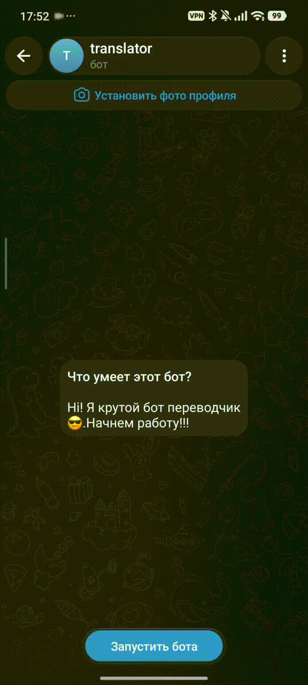

# 🤖 Telegram-бот для перевода и изучения языков

Telegram-бот для перевода текста, документов и голосовых сообщений, а также для изучения иностранных слов.

Бот объединяет функции **переводчика** и **тренажёра словарного запаса**: пользователь может сохранять переводы, добавлять слова в избранное, изучать новые слова, проходить повторения и отслеживать свой прогресс.


## 🎬 Демонстрация



## 🚀 Открыть бота в Telegram

[](https://t.me/The_new_Translator_bot)

## ✨ Возможности

### 🌍 Перевод

* Перевод текстовых сообщений
* Перевод документов
* Поддержка документов различных форматов
* Перевод голосовых сообщений
* Озвучивание текста
* Выбор языка перевода
* Сохранение истории переводов

### 📄 Работа с документами

Бот умеет принимать документы и извлекать из них текст для последующего перевода.

Работа с документами вынесена в отдельные сервисы:

* `document_parser.py` — извлечение текста
* `document_service.py` — обработка документов
* `document_writer.py` — формирование результата

### 📚 Изучение слов

* Изучение новых слов
* Выбор категории
* Выбор уровня сложности
* Варианты ответа
* Проверка правильности ответа
* Повторение изученных слов
* Работа со сложными словами
* Система прогресса
* Интервальное повторение

### ⭐ Избранное

Пользователь может:

* добавить перевод в избранное;
* убрать перевод из избранного;
* просматривать список избранных переводов.

### 📖 История

Хранится история переводов пользователя.

Доступны:

* просмотр истории;
* просмотр конкретного перевода;
* удаление отдельного элемента;
* очистка истории;
* пагинация.

### 📊 Статистика и прогресс

Бот отслеживает:

* количество переводов;
* количество избранных переводов;
* изученные слова;
* сложные слова;
* правильные и неправильные ответы;
* XP;
* серию дней активности;
* дневную цель;
* результаты учебной сессии.

### 🔥 Серия активности

Пользователь получает серию дней за регулярное использование бота.

При активности:

```text
1 день → 2 дня → 3 дня → ...
```

Если пользователь пропускает день, серия начинается заново.

### 🏆 XP

За выполнение учебных действий пользователь получает опыт.

XP хранится в базе данных и используется для формирования прогресса пользователя.

---

# 🛠 Технологии

Проект построен на Python и асинхронном стеке.

### Основные технологии

* **Python**
* **aiogram** — Telegram Bot API
* **PostgreSQL** — основная база данных
* **asyncpg** — асинхронная работа с PostgreSQL
* **Redis** — хранение временных данных / состояния
* **Pydantic** — конфигурация и валидация данных
* **Alembic** — миграции базы данных
* **pytest** — тестирование
* **Docker / Docker Compose** — контейнеризация

---

# 📁 Структура проекта

```text
bot1/
│
├── alembic/                    # Миграции базы данных
│   ├── versions/
│   ├── env.py
│   └── script.py.mako
│
├── common/                     # Общие компоненты
│   └── bot_cmds_list.py
│
├── config/                     # Конфигурация приложения
│   ├── settings.py
│   └── __init__.py
│
├── database/                   # Работа с БД и Redis
│   ├── redis_client.py
│   ├── requests.py
│   ├── seed_a1_words.py
│   └── init/
│
├── filters/                    # Фильтры Telegram
│   └── history_data.py
│
├── handlers/                   # Telegram handlers
│   ├── cancel.py
│   ├── document.py
│   ├── history.py
│   ├── language.py
│   ├── learn.py
│   ├── menu.py
│   ├── pictury.py
│   ├── profile.py
│   ├── review.py
│   ├── settings.py
│   ├── start.py
│   ├── translate.py
│   └── voice.py
│
├── keyboards/                  # Inline / Reply клавиатуры
│   ├── category_kbd.py
│   ├── favorites_kbd.py
│   ├── history_kbd.py
│   ├── language_kbd.py
│   ├── learn_mode_kbd.py
│   ├── level_kbd.py
│   ├── menu_kbd.py
│   ├── study_kbd.py
│   └── translate_kbd.py
│
├── models/                     # Модели базы данных
│   ├── base.py
│   ├── user.py
│   ├── words.py
│   ├── word_progress.py
│   ├── history.py
│   ├── translation.py
│   ├── daily_goal.py
│   ├── learning_session.py
│   ├── study_session.py
│   └── user_words.py
│
├── services/                   # Бизнес-логика приложения
│   ├── translator.py
│   ├── translation_service.py
│   ├── document_parser.py
│   ├── document_service.py
│   ├── document_writer.py
│   ├── voice_service.py
│   ├── dictionary_service.py
│   ├── history_service.py
│   ├── language_service.py
│   ├── learning_service.py
│   ├── profile_service.py
│   ├── daily_login_service.py
│   ├── message_service.py
│   ├── tts.py
│   └── word_sender.py
│
│   └── learning/               # Repository / слой работы с данными
│       ├── repository.py
│       ├── result.py
│       ├── constants.py
│       ├── utils.py
│       ├── daily_repository.py
│       ├── dictionary_repository.py
│       ├── document_repository.py
│       ├── history_repository.py
│       ├── language_repository.py
│       ├── profile_repository.py
│       └── translate_repository.py
│
├── states/                     # FSM-состояния
│   ├── learn_state.py
│   └── translate_state.py
│
├── tests/                      # Тесты
│   └── services/
│       ├── test_daily_login_service.py
│       ├── test_dictionary_service.py
│       ├── test_document_service.py
│       ├── test_history_service.py
│       ├── test_learning_service.py
│       ├── test_profile_service.py
│       ├── test_translation_service.py
│       └── test_voice_service.py
│
├── utils/                      # Вспомогательные функции
│   ├── achievements.py
│   ├── level.py
│   ├── logger.py
│   └── xp.py
│
├── fonts/                      # Шрифты
│   └── Arial.ttf
│
├── temp/                       # Временные файлы
│
├── main.py                     # Точка входа приложения
├── Dockerfile                  # Docker-образ
├── docker-compose.yml           # Docker Compose
├── alembic.ini                 # Конфигурация Alembic
├── requirements.txt            # Зависимости
├── Pipfile                     # Зависимости Pipenv
├── Pipfile.lock
├── pytest.ini                  # Конфигурация pytest
├── .dockerignore
└── .gitignore
```

---

# 🏗 Архитектура

Проект разделён на несколько логических уровней.

```text
Telegram
   │
   ▼
Handlers
   │
   ▼
Services
   │
   ▼
Repositories
   │
   ▼
PostgreSQL / Redis
```

### Handlers

Отвечают за взаимодействие с Telegram:

* получение сообщений;
* нажатия кнопок;
* документы;
* голосовые сообщения;
* команды пользователя.

### Services

Содержат основную бизнес-логику приложения.

Например:

```text
translation_service
learning_service
document_service
voice_service
history_service
profile_service
```

### Repositories

Отвечают за работу с данными и отделяют бизнес-логику от базы данных.

### Models

Описывают структуру сущностей приложения и базы данных.

---

# ⚙️ Конфигурация

Конфигурация проекта находится в:

```text
config/settings.py
```

Для хранения секретных данных используется `.env`.

Пример:

```env
BOT_TOKEN=your_bot_token

DB_USER=postgres
DB_PASSWORD=your_password
DB_NAME=your_database
DB_HOST=localhost
DB_PORT=5432

REDIS_HOST=localhost
REDIS_PORT=6379
```

Файл `.env` не должен попадать в Git.

---

# 🚀 Запуск проекта

## 1. Клонирование

```bash
git clone <repository-url>
cd bot1
```

## 2. Создание виртуального окружения

```bash
python -m venv .venv
```

Windows:

```bash
.venv\Scripts\activate
```

Linux / macOS:

```bash
source .venv/bin/activate
```

## 3. Установка зависимостей

```bash
pip install -r requirements.txt
```

## 4. Настройка `.env`

Создайте файл:

```text
.env
```

и добавьте необходимые переменные окружения.

## 5. Миграции

```bash
alembic upgrade head
```

## 6. Запуск

```bash
python main.py
```

---

# 🐳 Запуск через Docker

В проекте присутствуют:

```text
Dockerfile
docker-compose.yml
.dockerignore
```

Запуск:

```bash
docker compose up --build
```

Запуск в фоне:

```bash
docker compose up -d --build
```

Остановка:

```bash
docker compose down
```

---

# 🗄 База данных

Основная база данных проекта — **PostgreSQL**.

Для асинхронного взаимодействия используется:

```text
asyncpg
```

Миграции выполняются через:

```text
Alembic
```

Основные сущности проекта:

```text
users
history
words
word_progress
daily_goal
study_session
learning_session
```

---

# 🔄 Система интервального повторения

Для изучения слов используется система повторений.

В зависимости от результата пользователя изменяется:

* количество правильных ответов;
* количество ошибок;
* стадия изучения;
* статус `learned`;
* дата следующего повторения.

Пример интервалов:

```text
Правильный ответ
      ↓
3 дня
      ↓
7 дней
      ↓
14 дней
      ↓
30 дней
```

При неправильном ответе слово возвращается на повторение раньше.

---

# 🧪 Тестирование

Для тестирования используется `pytest`.

Запуск всех тестов:

```bash
pytest
```

Запуск тестов с подробным выводом:

```bash
pytest -v
```

Тесты находятся в:

```text
tests/
```

---

# 🔐 Безопасность

Не добавляйте в Git:

```text
.env
*.pyc
__pycache__/
.venv/
.pytest_cache/
```

Секретные данные должны храниться в переменных окружения.

Для этого используется `.gitignore`.

---

# 📌 Основные компоненты

| Компонент           | Назначение                            |
| ------------------- | ------------------------------------- |
| `handlers`          | Обработка действий пользователя       |
| `services`          | Бизнес-логика                         |
| `services/learning` | Работа с учебной логикой и repository |
| `models`            | Модели данных                         |
| `database`          | Работа с PostgreSQL и Redis           |
| `keyboards`         | Клавиатуры Telegram                   |
| `states`            | FSM-состояния                         |
| `filters`           | Фильтры                               |
| `utils`             | Вспомогательные функции               |
| `tests`             | Автоматические тесты                  |
| `alembic`           | Миграции БД                           |
| `config`            | Конфигурация                          |

---

# 📈 Что умеет бот

```text
Перевод текста
      │
      ├── История
      ├── Избранное
      ├── Статистика
      └── XP

Документ
      │
      ├── Извлечение текста
      ├── Перевод
      └── Формирование результата

Голос
      │
      ├── Распознавание
      ├── Перевод
      └── Озвучивание

Изучение слов
      │
      ├── Новые слова
      ├── Категории
      ├── Уровни
      ├── Проверка знаний
      ├── Повторение
      ├── XP
      ├── Дневная цель
      └── Серия дней
```

---

# 👨‍💻 Статус проекта

Проект находится в разработке.

Основная цель — создать полноценного Telegram-помощника для перевода и систематического изучения иностранных языков.

---
